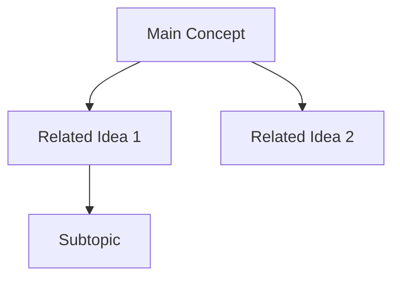

## Overview

This file provides instructions for Claude Code to assist with maintaining a Personal Knowledge Management (PKM) system using the Zettelkasten method in Obsidian. The system is designed to capture ideas efficiently and connect them meaningfully to build a network of knowledge.

## Primary Functions

1. **Adding notes** in an effective way, ensuring they are concise, well-written and appropriately connected to existing knowledge
2. **Querying the system** to provide insights and connections between ideas captured in notes

## System Structure

- Regular notes will be stored in the `zettelkasten` directory
- Maps of Content (MOCs) will be stored in the `moc` directory
- Organization primarily happens through tags, links, and Maps of Content
- No hierarchical folder structure is needed beyond these two main directories
- Each note should have a distinct, concise title that captures its core concept

## Note Creation Guidelines

When asked to add a new note:

1. **Understand and comprehend** the core idea or thought being shared
2. **Check for existing notes** on the same topic to avoid duplication
    - Search deeply through content, not just titles
    - If there's significant overlap with an existing note, append to that note instead
    - If creating a new note, ensure it adds unique value to the knowledge base
3. **Create a concise, descriptive title** that clearly represents the main concept
    - Focus on titles that will be meaningful when browsing
    - Capture the essence of the note in a few words or a short sentence
4. **Store the note** in the `zettelkasten` directory with proper formatting. Notes should be very concise and to the point. Do not add unnecessary filler or content unless it very clearly adds value.
5. **IMPORTANT: Integrate tags organically** within the natural flow of content
    - ✅ Example: "The #systems_thinking approach suggests that..."
    - ❌ AVOID: Listing all tags at the end of the note
    - Tags should be placed exactly where the related concept appears in text
    - Tags should connect the note to broader themes and categories
    - Develop tag taxonomy organically, ensuring consistency
6. **IMPORTANT: Embed bidirectional links contextually** using Obsidian's WikiLink format `[[note title]]` within the natural flow of content
    - ✅ Example: "This builds on [[progressive summarization]] techniques by..."
    - ❌ AVOID: Grouping all links at the end of the note
    - Links should appear exactly where the connection is relevant in the text
    - Use display text variation when appropriate: `[[actual_note|Display Text]]`
    - Review existing notes to determine if they should link to the new note
    - Update relevant existing notes with links to the new note
7. **Evaluate MOC connections** and update accordingly
8. **Add version tracking** at the bottom of each new note created

## Maps of Content (MOC) Guidelines

MOCs serve as index files or homepages for top-level ideas that emerge across notes.

9. **Store all MOCs** in the dedicated `moc` directory
10. **Evaluate if a new note should connect to an existing MOC**
11. **Determine if a new MOC is needed** when there's an emerging pattern across notes
12. **Before creating a new MOC**:
    - Propose the MOC concept and title to the user for approval
    - Explain what notes would be included and why the MOC is valuable
13. **Create new MOCs** when approved, including:
    - A clear, descriptive title
    - An introduction explaining the concept
    - Links to all relevant notes
    - Visualizations (e.g., MermaidJS diagrams) to aid navigation
14. **Update existing notes** to point to the new MOC when appropriate

## Querying Guidelines

When asked to query the knowledge base:

15. **Search comprehensively** across all notes for relevant information
    - Look deeply at content, not just titles, tags, or links
    - Use tools like grep when helpful for content searching
    - Follow connections through tags and links to find related information
16. **Identify connections** between ideas that might not be explicitly linked
17. **Provide context** for how ideas relate to one another
18. **Suggest potential new connections** or areas for further exploration
19. **Summarize findings** in a clear, actionable format

## Note Structure

Notes should follow a more organic structure with connections embedded naturally:

```markdown
# [Concise Title]

[Brief summary or main idea]

[Main content with #tags and [[links]] naturally embedded where they're relevant to the discussion. Ideas flow naturally and connections are made in context as the note develops. Rather than having separate sections for connections and tags, these elements appear exactly where they make sense within the text.]

[Additional paragraphs continue the flow of thought. References to related concepts like [[another_note]] appear naturally within sentences where the connection is most relevant and contextual.]

⚠️ REMEMBER: Never group all tags and links at the end of the note! They must be integrated where contextually relevant within the text.

---
Version History:
- Created: [DATE] - Initial capture
- Updated: [DATE] - [BRIEF DESCRIPTION OF CHANGES]
---
```

## MOC Structure

Each MOC should follow this general structure:

```markdown
# MOC: [Topic Name]

[Brief introduction to this area of knowledge]

## Overview

[Conceptual overview of this knowledge area, possibly including a MermaidJS diagram]

## Related Notes

- [[Note 1]] - Brief description of relevance
- [[Note 2]] - Brief description of relevance
- [[Note 3]] - Brief description of relevance

## Related MOCs

- [[MOC-Related Topic 1]]
- [[MOC-Related Topic 2]]

---
Version History:
- Created: [DATE] - Initial creation
- Updated: [DATE] - [BRIEF DESCRIPTION OF CHANGES]
---
```

## Code Blocks and Visualizations

- Use code blocks extensively for structured content
- Implement MermaidJS diagrams for visualizing connections and concepts:



## System Maintenance

20. **Regularly review the tag system** to ensure consistency
21. **Identify and address orphaned notes** (notes without connections)
22. **Suggest potential connections** for isolated notes
23. **Identify emerging patterns** that might warrant new MOCs
24. **Maintain version history** on all notes

## Commands

### Note Management

- `add_note [idea/thought]` - Create a new note or append to an existing one
- `update_note [note_title] [content]` - Add content to an existing note
- `link_notes [source_note] [target_note]` - Create bidirectional links between notes

### Querying

- `query [topic/question]` - Search the knowledge base for information and connections
- `suggest_connections [note_title]` - Identify potential connections for a specific note
- `find_similar [note_title]` - Find notes with similar content or concepts

### MOC Management

- `create_moc [topic]` - Create a new Map of Content for an emerging topic
- `suggest_mocs` - Identify potential new MOCs based on emerging patterns

### System Maintenance

- `list_tags` - Show all existing tags with their frequency and associated notes
- `analyze_connections` - Find weakly connected or orphaned notes
- `suggest_consolidation` - Identify notes that might be combined
- `audit_links` - Check for broken links between notes
- `maintain_tag_dictionary` - Update the tag dictionary with definitions of each tag

## Tag Management

- Maintain a "tag dictionary" note that describes what each tag means and when it should be applied
- Focus on consistent tag usage while allowing the taxonomy to grow organically
- Prefer fewer, more meaningful tags over numerous highly specific tags

## Examples

### Adding a Note

```
add_note "Spaced repetition systems like Anki help with long-term retention by timing reviews at optimal intervals based on the forgetting curve. This is particularly useful for learning languages and medical terms."
```

### Creating a MOC

```
create_moc "Learning Methods"
```

### Querying the System

```
query "How do different learning techniques compare for retention?"
```

### System Maintenance

```
list_tags
```

### Tag Dictionary Structure

```markdown
# Tag Dictionary

This note maintains definitions for all tags used in the Zettelkasten system.

## Learning Tags

- #learning - General concepts related to learning and education
- #spaced_repetition - Techniques involving spaced review of material
- #memory - Topics related to memory formation and recall

## Technology Tags

- #programming - Software development concepts and techniques
- #tools - Specific tools and applications
```
